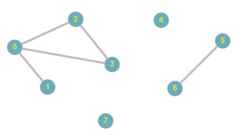
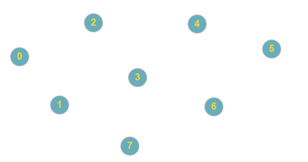
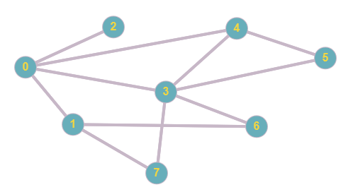
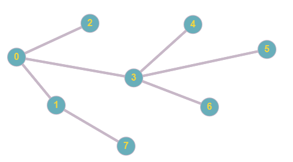

# Thesis Worklog

This text is used to keep track of the work done so far, as well as to give a detailed and exaustive explanation about the decisions taken during the code development and the process followed through it. 

## Checklist
- [x] Abstract model definition in pyomo
- [x] Automatic graph generation
- [ ] Ant colony algoritm for vertex cover problem

## Automatic graph generation
Methods which randomly generate many graph istances are a compulsory prerequisite for the entire project. A basic library to generate random graphs was built to accomplish the task, initially without any excessive optimization on computational complexity. Further improvements on this aspect should be considered in the future, to reduce the time and the resources devoted to preliminary graph computing. 

The library is based on the simplest possible implementation of a graph: vertices are represented by progressive positive integers, whereas edges are represented by two-element tuples. The library has two main methods, which generates two different types of graphs.

### `generate_graph(dimension, edge_density)` 
Generates a number of vertices specified by the `dimension` parameter, compute all the possible edges between vertices (which correspond to all the possible 2-combination in the vertices set) and then attach them a randomic probability. The edges set is then pruned using the parameter `edge_density`, a float number in the range \[0,1] used to manage the number of edges that the final graph must contain (0 generates a graph with no edges, 1 generates a complete graph). 

However, the distribution of the random likelihoods assigned to each edge is not uniform, therefore the edge density might experience sensibile variations associated to null or minor variation of the density parameter. This issue might be solved in the future. 

 

*Graph generated using a medium density param*

*Graph generated using a density param equal to zero*

### `generate_connected_graph(dimension, edge_density)` 
Generates a randomic instance of connected graph, containing a number of vertices defined by the `dimension` parameter.

The method based on iteraction: generates a vertex, links it to another randomic vertex (impossible to obtain stand-alon vertices) and then iterate over the remaining vertices to create new edges. Edges creation is probabilistic and can be manage through the `edge_density`parameter (0 generates a spanning tree, 1 generates a complete graph). Even in this case there are problems correlated to the not uniform distribution of random likelyhoods.

*Graph generated using a medium density param*

*Graph generated using a density param equal to zero*

**Update 18/3/21**
Further analysis were performed on the probability distribution of the numpy.random.py(). I tried to use numpy.random.uniform() instead, but the results were more or less the same, so I opted to maintain the initial (and simpler) code. Return value was finally changed to the format required by the MIP solver. Minor bug fixies.

